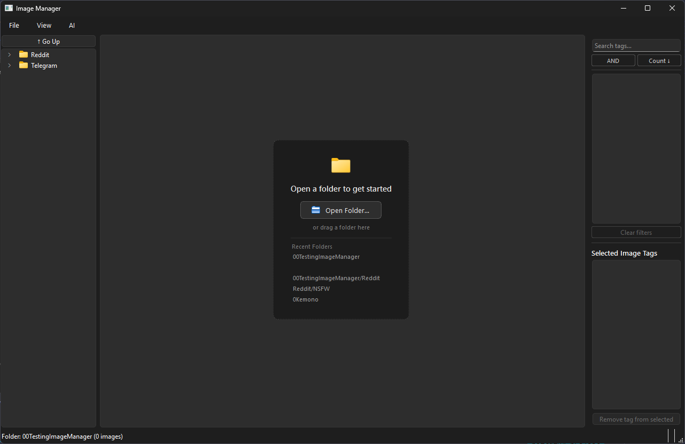

# Image Manager

A desktop image library application for Windows — browse folders, tag images with AI, organize into albums, triage large collections, and detect duplicates.



---

## Features

- **Paginated gallery** — lazy-loading thumbnails (200 per page), three density modes, 500ms hover card with filename, size, and tags
- **Tag system** — filter by tags with AND/OR mode, per-category grouping (rating / general), global rename and delete, saved filter presets (Smart Collections)
- **Albums** — create, rename, delete; drag thumbnails from gallery onto an album to add them
- **Triage Mode** — full-screen image review with single-key shortcuts (S / T / A / D)
- **SFW Mode** — hides `rating:explicit` and `rating:questionable` images across all views
- **AI: WD14 Tagging** — automatic general, character, and rating tags via `SmilingWolf/wd-swinv2-tagger-v3` (ONNX, CPU); resumable
- **AI: Sort SFW/NSFW** — batch-move images into separate folders by their rating tags
- **AI: Find Duplicates** — two-phase SHA-256 scan with a card-per-image resolution UI
- **File operations** — move, copy, trash, and permanent delete with confirmation dialogs
- **Headless CLI** — `src/utils/batch_tag.py` for batch WD14 tagging without the GUI

---

## Requirements

| Requirement | Details |
|---|---|
| OS | Windows 10 / 11 (x64) |
| Python | 3.12 or newer (developed on 3.14) |
| C++ Redistributable | [Visual C++ 2015–2022 x64](https://aka.ms/vs/17/release/vc_redist.x64.exe) — required for the built `.exe`; not needed when running from source |
| Disk | ~400 MB for the WD14 model (downloaded on first use, cached in `~/.cache/huggingface/`) |
| Internet | Required only on the first WD14 tagging run |

---

## Dependencies

| Package | Min version | Purpose |
|---|---|---|
| `PyQt6` | 6.6.0 | GUI framework |
| `Pillow` | 10.0.0 | Image decoding and thumbnail generation |
| `onnxruntime` | 1.18.0 | WD14 AI inference (CPU) |
| `huggingface_hub` | 0.23.0 | WD14 model download and caching |
| `numpy` | 1.26.0 | Image pre-processing for WD14 |
| `send2trash` | 1.8.0 | Safe deletion (moves to Recycle Bin) |

---

## Installation (from source)

```bash
git clone <repo-url>
cd ImageManager

python -m venv .venv
.venv\Scripts\pip install -r requirements.txt

.venv\Scripts\python main.py
```

---

## Building the Executable

Run the build script from the repo root:

```bat
build\build.bat
```

What it does:
1. Verifies `.venv` exists; auto-installs PyInstaller if missing
2. Cleans `build\ImageManager\` (intermediate files) and `dist\ImageManager\` (previous output)
3. Runs `PyInstaller` with `build\ImageManager.spec`
4. Verifies `dist\ImageManager\ImageManager.exe` was created

Output folder: `dist\ImageManager\` — copy this entire folder to distribute.

> **Notes:**
> - MSVC runtime DLLs (`msvcp140.dll`, `vcruntime140.dll`) are intentionally **not bundled**. The app uses the system-installed C++ Redistributable instead, avoiding version conflicts with onnxruntime.
> - The WD14 model is **not bundled** — it downloads on first use (~400 MB).

---

## Usage

### Opening Images

- `Ctrl+O` — open a folder dialog
- Drag a folder onto the empty gallery
- Click a recent folder in the empty-state overlay (last 5 folders remembered)
- Click any folder in the **Folder Tree** (left panel, toggle with `Ctrl+1`)

### Gallery

The gallery shows up to 200 images per page with lazy thumbnail loading.

- **Density** — `View → Density` cycles between Compact / Comfortable / Spacious tile sizes
- **Hover card** — hover over a thumbnail for 500ms to see filename, file size, and tags
- **SFW Mode** — `View → SFW Mode` hides explicit/questionable images; a status indicator appears bottom-right
- **Pagination** — Previous / Next buttons at the bottom of the gallery

**Right-click context menu:**
| Option | Action |
|---|---|
| View | Open image in full-size viewer |
| Triage from here… | Start Triage Mode from this image |
| Reveal in Tree | Navigate the folder tree to this image |
| Move to… | Move selected images to a folder |
| Copy to… | Copy selected images to a folder |
| Tags → Add tag… | Add a tag to selected images |
| Albums… | Open the Albums panel |
| Delete (Trash) | Send to Recycle Bin |
| Delete Permanently | Delete from disk (cannot be undone) |

### Tag Panel

The Tag Panel (right sidebar, toggle with `Ctrl+2`) lists all tags with per-tag image counts.

- Tags are grouped into **Rating** (amber) and **General** (blue) categories
- Click checkboxes to filter the gallery
- **AND / OR** toggle — AND requires all selected tags; OR matches any
- Active filter tags appear as removable chips above the gallery
- **Search box** — filters the tag list in real time (0 database calls)
- **Sort** — toggle between count-descending and alphabetical
- **Right-click a tag** — Rename globally or Delete globally (with confirmation)

**Smart Collections** (saved filter presets) appear below albums in the Albums panel. Double-click to apply the saved filter.

### Albums

Open via `View → Albums…` or the gallery context menu.

| Action | How |
|---|---|
| Create | Type a name in the "New album…" field and press Enter |
| Add images | Select images in gallery, then click "Add selected to album"; or drag thumbnails onto an album |
| Remove images | Select images, then click "Remove selected from album" |
| Rename | Select album → Rename album button |
| Delete | Select album → Delete album button (images are not deleted) |
| Load album | Double-click album name |

### Triage Mode (`Ctrl+K`)

Full-screen review mode. Use the keyboard to act on each image and navigate.

| Key | Action |
|---|---|
| `S` | Add **star** tag |
| `T` | Open **tag input** overlay (type tag, Enter to apply) |
| `A` | Open **album picker** overlay (double-click or Enter to select) |
| `D` | Send to **Trash** |
| `←` / `→` | Previous / Next image |
| `Esc` | Dismiss overlay; press again to close Triage Mode |

A HUD at the bottom shows the legend. After each action the HUD briefly confirms what happened, then resets.

### Image Viewer

Double-click any thumbnail to open the full-size viewer.

- **Fit** / **100%** buttons, or scroll the mouse wheel to zoom (5% – 5000%)
- `←` / `→` — previous / next image in the current folder/filter
- `Esc` — close
- Right panel shows: filename, path, dimensions, file size, timestamps, albums, and tags
- Videos open with the system default player

### AI: WD14 Tagging

Automatically tags images with general descriptors, character names, and a safety rating.

**First use:** the model (`SmilingWolf/wd-swinv2-tagger-v3`, ~400 MB) downloads to `~/.cache/huggingface/`. An internet connection is required once.

**Tag selected images:** select images → `Ctrl+T` (or `AI → Tag with WD14…`)

**Tag all images in folder:** `AI → Tag All in Folder…` — shows a summary dialog (total / already tagged / to tag), then runs with an ETA counter in the status bar.

Tagging is **resumable** — images that already have a `rating:*` tag are skipped automatically.

**Rating tags produced:**
- `rating:general`, `rating:sensitive`, `rating:explicit`, `rating:questionable`

### AI: Sort SFW/NSFW

Batch-moves images into separate folders based on their `rating:*` tag.

1. `AI → Sort into SFW/NSFW by Tags…`
2. A preview dialog shows: how many images will go to SFW, how many to NSFW, and how many are skipped (no rating tag)
3. Choose the SFW destination folder and the NSFW destination folder
4. Images are **moved** (not copied); untagged images are not touched

### AI: Find Duplicates

Finds images with identical content regardless of filename.

1. `AI → Find Duplicates…`
2. **Phase 1** — hashes unprocessed images (SHA-256 of first 64 KB + file size)
3. **Phase 2** — groups images with matching hashes
4. The Duplicates dialog shows a card per image in each group with thumbnail, filename, file size, and dimensions
5. Select which image to **Keep** per group (radio button), or use:
   - `O` — Keep Oldest (by file modification date)
   - `N` — Keep Newest
6. **Send to Trash** or **Delete Permanently** to remove the unselected images

### File Operations

All destructive operations show a confirmation dialog.

| Operation | How | Reversible |
|---|---|---|
| Move | RMB → Move to… | No (files move on disk) |
| Copy | RMB → Copy to… | N/A |
| Trash | RMB → Delete (Trash) | Yes (Recycle Bin) |
| Permanent delete | RMB → Delete Permanently | No |

File moves run on a background thread; images are removed from the gallery as each one completes.

### Library Cleanup

`File → Clean Up Missing Files from Library` removes database entries for images that no longer exist on disk.

### Headless CLI Batch Tagger

`src/utils/batch_tag.py` tags a page range of images without opening the GUI. Edit the `START_PAGE` / `END_PAGE` constants at the top of the file, then:

```bash
.venv\Scripts\python src\utils\batch_tag.py
```

It reads the last opened folder from QSettings and reports `Tagged / Skipped / Errors` on completion.

---

## Keyboard Shortcuts

### Main Window

| Shortcut | Action |
|---|---|
| `Ctrl+O` | Open folder |
| `Ctrl+1` | Toggle Folder Tree (left panel) |
| `Ctrl+2` | Toggle Tag Panel (right panel) |
| `Ctrl+K` | Triage Mode |
| `Ctrl+T` | Tag selected images with WD14 |
| `Ctrl+Q` | Quit |

### Image Viewer

| Shortcut | Action |
|---|---|
| `←` / `→` | Previous / Next image |
| `Esc` | Close |

### Triage Mode

| Key | Action |
|---|---|
| `S` | Star (adds "star" tag) |
| `T` | Tag input overlay |
| `A` | Album picker overlay |
| `D` | Trash |
| `←` / `→` | Previous / Next image |
| `Esc` | Dismiss overlay / close |

### Duplicates Dialog

| Key | Action |
|---|---|
| `O` | Keep Oldest in each group |
| `N` | Keep Newest in each group |

---

## Data and Storage

| Data | Location |
|---|---|
| Database | `data/imagemanager.db` (SQLite, created on first run) |
| Thumbnail cache | `%APPDATA%\ImageManager\thumbs\` (256 px JPEGs) |
| WD14 model | `~/.cache/huggingface/` (~400 MB, auto-managed) |
| App settings | Windows Registry: `HKCU\Software\ImageManager\ImageManager` |

Settings persisted across sessions: last opened folder, SFW Mode state, gallery density, panel visibility, splitter positions, and recent folders (up to 5).

---

## Additional Notes

**Import order (Windows DLL quirk)**
`onnxruntime` is imported before `PyQt6` in `main.py`. This is required on Windows to prevent DLL path conflicts between the two libraries. Do not reorder these imports.

**Tag recovery**
When an image file is moved or renamed outside the app and then re-introduced to the library, Image Manager attempts to recover its tags, albums, and AI results automatically — first by SHA-256 content-hash match, then by unambiguous filename match.

**Resumable WD14 tagging**
Any tagging session can be interrupted (via `AI → Cancel`) and resumed later. Images with an existing `rating:*` tag are always skipped.

**Duplicate detection speed**
The scanner reads only the first 64 KB of each file (plus file size) to compute the hash, making it fast even on large libraries. Full-file reads are never performed.

**SFW Mode scope**
SFW Mode filters apply everywhere in the app — gallery, triage, and image viewer navigation all hide `rating:explicit` and `rating:questionable` images while the mode is active.
